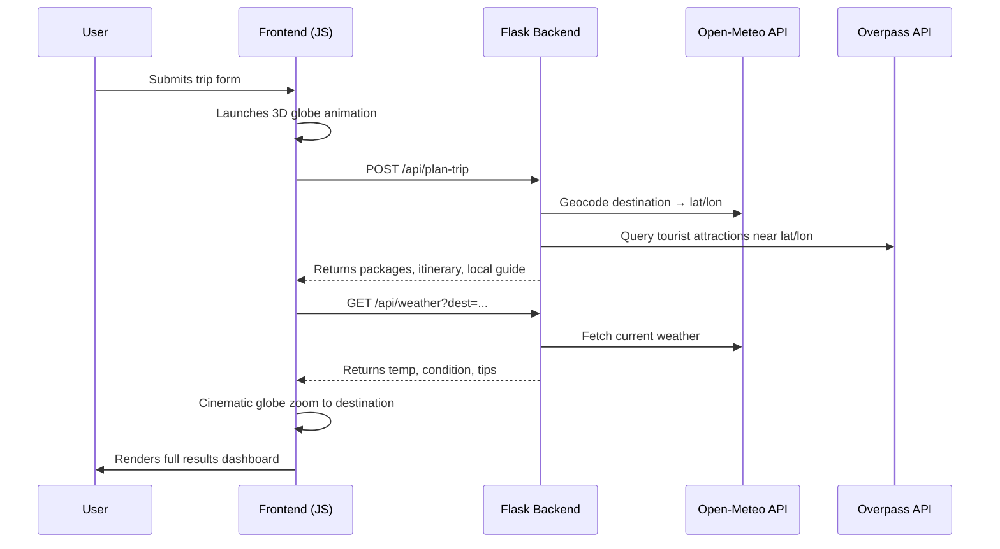

# ✈️ Dora Travel Agency — AI Travel Assistant

> **Design your dream trip in seconds.** An intelligent, full-stack travel planning web application powered by real-world APIs, featuring a cinematic 3D globe experience and personalized itinerary generation.

---

## 🌍 Live Demo

Deploy this project instantly on **[Vercel](https://vercel.com)** (see deployment guide below).

---

## ✨ Features

| Feature | Description |
|---|---|
| 🌐 **Cinematic 3D Globe** | Interactive globe powered by `Three.js` & `Globe.gl` with real-time flight path animations and a dramatic destination zoom |
| 🤖 **AI Itinerary Generator** | Generates a full day-by-day travel itinerary based on your destination, duration, and special interests |
| 📦 **3-Tier Travel Packages** | Budget, Medium, and Luxury packages with estimated costs, hotel tier, flight class, and transport options |
| 🌦️ **Live Weather Widget** | Real-time weather data from Open-Meteo API with smart travel tips based on temperature and conditions |
| 🗺️ **Local Culture Guide** | Language basics, local currency, signature foods, safety tips, and cultural etiquette for 15+ countries |
| 🎒 **Smart Packing List** | Auto-generated packing checklist that adapts based on destination weather conditions |
| 📍 **Real Attraction Data** | Pulls live tourist attractions from **OpenStreetMap Overpass API** based on geocoordinates |
| 🌓 **Dark / Light Mode** | Seamless theme toggling with a premium glassmorphism UI |

---

## 🛠️ Tech Stack

### Frontend
- **HTML5** — Semantic structure
- **Vanilla CSS** — Custom glassmorphism design system with CSS variables and smooth animations
- **JavaScript (ES6+)** — Async/Await, DOM manipulation, dynamic rendering
- **Three.js** + **Globe.gl** — 3D interactive globe with arc animations and location pins
- **Font Awesome 6** — Icon library
- **Google Fonts** — *Playfair Display* & *Inter* typography

### Backend
- **Python + Flask** — Lightweight REST API server
- **Flask-CORS** — Cross-origin request handling
- **Requests** — HTTP client for external API calls

### External APIs (Free, No Key Required)
| API | Usage |
|---|---|
| [Open-Meteo](https://open-meteo.com/) | Live weather forecasts |
| [Open-Meteo Geocoding](https://open-meteo.com/en/docs/geocoding-api) | City → Latitude/Longitude lookup |
| [Overpass API (OpenStreetMap)](https://overpass-api.de/) | Real tourist attractions near destination |

### Deployment
- **Vercel** — Serverless deployment (Python backend via `vercel.json` rewrites)

---

## 📁 Project Structure

```
dora travel agency/
├── index.html          # Main application shell (SPA with two views)
├── style.css           # Full design system — glassmorphism, animations, themes
├── script.js           # All frontend logic — globe, API calls, rendering
├── index.py            # Flask backend — trip planning & weather endpoints
├── requirements.txt    # Python dependencies
├── vercel.json         # Vercel serverless routing config
└── test_overpass.py    # Utility script to test the Overpass API connection
```

---

## 🚀 Getting Started (Local Development)

### Prerequisites

- **Python 3.8+**
- **pip**
- A modern web browser

### 1. Clone the Repository

```bash
git clone <your-repo-url>
cd "dora travel agency"
```

### 2. Install Python Dependencies

```bash
pip install -r requirements.txt
```

### 3. Run the Backend Server

```bash
python index.py
```

The Flask API will start at `http://127.0.0.1:5000`.

### 4. Open the Frontend

Open `index.html` directly in your browser, or serve it with any static file server:

```bash
# Using Python's built-in server (optional)
python -m http.server 8080
```

Then navigate to `http://localhost:8080`.

> **Note:** The frontend auto-detects `localhost` and routes all API calls to `http://127.0.0.1:5000/api`. No configuration needed.

---

## ☁️ Deployment on Vercel

This project is configured for **zero-configuration Vercel deployment**.

1. **Install Vercel CLI** (optional) or use the [Vercel Dashboard](https://vercel.com/new)
2. **Import your repository** into Vercel
3. Vercel automatically uses `vercel.json` to route `/api/*` calls to the Python serverless function

```json
{
  "rewrites": [
    { "source": "/api/(.*)", "destination": "/api/index.py" }
  ]
}
```

> The Python file must be placed inside an `api/` directory for Vercel's serverless Python runtime. Ensure `index.py` is at `api/index.py` for production deployment.

---

## 🔌 API Endpoints

### `POST /api/plan-trip`

Generates a complete travel plan for a given destination.

**Request Body:**
```json
{
  "destination": "Tokyo",
  "days": 5,
  "budget": "medium",
  "interests": "Food, History",
  "flightOption": "economy",
  "hotelChoice": "Hilton"
}
```

**Response:**
```json
{
  "destination": "Tokyo",
  "days": 5,
  "lat": 35.6762,
  "lon": 139.6503,
  "packages": [...],
  "mustVisits": [...],
  "localGuide": { "culture": "...", "food": "...", "safety": "...", ... }
}
```

---

### `GET /api/weather?dest={city}`

Fetches current weather for a given city name.

**Response:**
```json
{
  "temperature": 22,
  "condition": "Partly cloudy",
  "tips": "Perfect travel weather."
}
```

---

## 🌐 Supported Destinations (Enhanced Culture Data)

The backend includes a curated culture database for **15 countries** with rich local intel:

> 🇮🇹 Italy &nbsp;|&nbsp; 🇫🇷 France &nbsp;|&nbsp; 🇯🇵 Japan &nbsp;|&nbsp; 🇹🇷 Turkey &nbsp;|&nbsp; 🇬🇧 United Kingdom &nbsp;|&nbsp; 🇺🇸 United States &nbsp;|&nbsp; 🇹🇭 Thailand &nbsp;|&nbsp; 🇮🇳 India &nbsp;|&nbsp; 🇦🇪 UAE &nbsp;|&nbsp; 🇪🇸 Spain &nbsp;|&nbsp; 🇲🇽 Mexico &nbsp;|&nbsp; 🇬🇷 Greece &nbsp;|&nbsp; 🇩🇪 Germany &nbsp;|&nbsp; 🇪🇬 Egypt &nbsp;|&nbsp; 🇧🇷 Brazil

For all other destinations, the app gracefully falls back to generic, helpful travel advice.

---

## 🗺️ How It Works



---

## 🎨 UI / UX Highlights

- **Glassmorphism panels** with `backdrop-filter: blur`
- **CSS custom properties** for easy theming (dark/light modes)
- **Smooth fade-in-up animations** for staggered content loading
- **Cinematic 3D globe sequence**: neural network arcs → destination pin → zoom → reveal
- **Tabbed dashboard**: Packages, Itinerary timeline, Local Guide, Interactive Map (coming soon)
- **Responsive layout** with CSS Grid and Flexbox

---

## 🔮 Roadmap (Coming Soon)

- [ ] 📄 **PDF Export** — Download your full itinerary as a styled PDF
- [ ] 🗺️ **Interactive Map** — Embedded live map with attraction markers and routing
- [ ] 🏨 **Live Booking** — Deep-link integration with hotel and flight booking partners
- [ ] 💬 **AI Chat Companion** — Natural language trip refinement via an AI chat interface
- [ ] 📅 **Calendar Sync** — Export itinerary to Google/Apple Calendar

---

## 📄 License

This project is open-source and available under the [MIT License](LICENSE).

---

## 🙏 Acknowledgements

- [Globe.gl](https://globe.gl/) — Stunning 3D globe rendering
- [Open-Meteo](https://open-meteo.com/) — Free, open-source weather API
- [OpenStreetMap & Overpass API](https://www.openstreetmap.org/) — Community-driven map data
- [Font Awesome](https://fontawesome.com/) — Icon library
- [Google Fonts](https://fonts.google.com/) — Typography

---

<div align="center">
  <strong>Made with ❤️ by the Dora Travel Agency team</strong><br>
  <em>Explore the world. Let AI plan the journey.</em>
</div>
